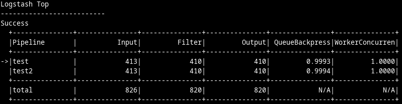
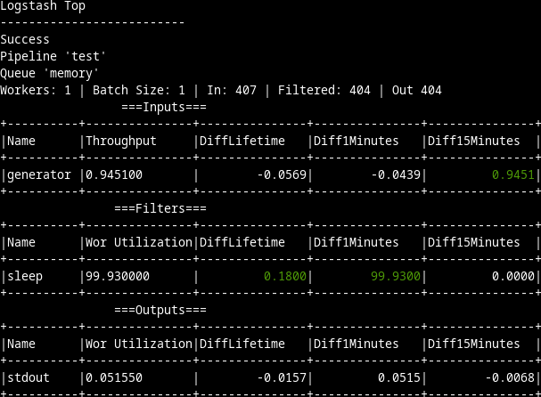

# Logstash Top

Logstash top is a top-like utility to display the Logsash metrics.
It is meant as an ad-hoc analysis tool and not a substitute for Stack Monitoring.

## Compile and Run

```
go mod tidy
go run ./cmd/main.go
```


## Usage

Once the tool starts, it fetches the list of Logstash pipelines:



Selecting a pipeline shows a detailed view



More commands can be found with the `h` key.